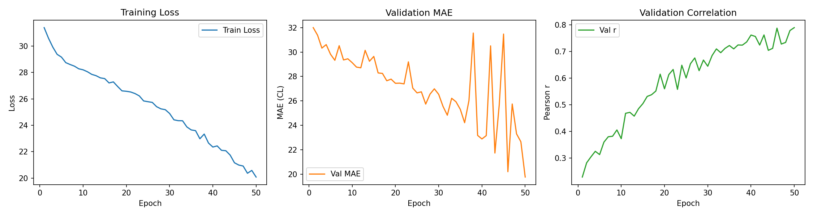
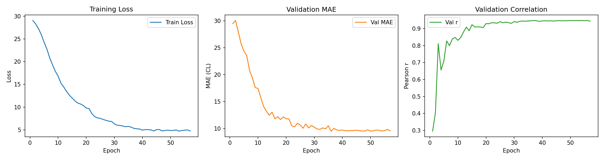

# 🧠 Standardizing Alzheimer’s Disease Biomarker Quantification: 3D Deep Learning for Amyloid PET Centiloid Prediction

## 📋 Executive Summary
Alzheimer's disease (AD) is a progressive neurodegenerative disorder and a critical global health challenge. A key pathological hallmark of AD is the accumulation of amyloid-beta ($\beta$-amyloid) plaques in the brain, which can appear decades before clinical symptoms manifest. Positron Emission Tomography (PET) imaging is the gold standard for detecting these plaques *in vivo*.

This project implements a clinical-grade **3D Deep Learning pipeline** to predict **Centiloid scores**—a standardized metric of brain amyloid burden—directly from preprocessed 3D PET volumes. 

This repository documents the evolutionary development of our solution:
1. **Version 1 (Baseline):** A sequential 3D CNN with late-stage tracer concatenation.
2. **Version 2 (Advanced - in [ABPET](file:///d:/MedicalArea/ABPET)):** A deep 3D ResNet-18 backbone utilizing **FiLM (Feature-wise Linear Modulation)** layers for intermediate multi-level tracer conditioning. Version 2 achieves a **51.8% reduction in prediction error** and operates with exceptional optimization stability.

---

## 🎯 Clinical & Scientific Significance

### 1. The Centiloid Scale: A Standardized Biomarker
Different clinical centers and clinical trials use different radiotracers to visualize amyloid. Because each tracer has unique binding affinities, noise thresholds, and contrast levels, comparing raw PET values across trials has historically been challenging. The **Centiloid scale** was established to harmonize these measurements:
* **0 Centiloids (CL):** Represents the average amyloid level of young, cognitively normal control subjects.
* **100 Centiloids (CL):** Represents the average amyloid level of typical patients diagnosed with Alzheimer’s dementia.
* **Continuous Prediction:** Predicting the exact continuous Centiloid level enables clinicians to track disease progression, predict cognitive decline, and monitor therapeutic response (e.g., clearance rates during anti-amyloid antibody treatments like lecanemab or donanemab).

### 2. The Multi-Tracer Challenge
The model must operate on scans acquired via four distinct radiotracers, each with a unique uptake profile:
* **`FBP`** (Florbetapir / $^{18}\text{F}$-AV-45) — Commonly used fluorine-18 tracer.
* **`FBB`** (Florbetaben / $^{18}\text{F}$-BAY94-9172) — Fluorine-18 tracer with high cortical affinity.
* **`NAV`** (Florbetanav / $^{18}\text{F}$-NAV4600) — Novel investigational fluorine-18 tracer.
* **`PIB`** (Pittsburgh Compound B / $^{11}\text{C}$-PIB) — The classical carbon-11 reference tracer.

Our contribution is the development of a model that **jointly represents** spatial features and tracer-specific properties to predict a standardized centiloid score, achieving excellent generalization across all clinical diagnostic protocols.

---

## 🛠️ Key Technical Contributions

* **Deep 3D Spatial Feature Extraction:** Designed and implemented a 3D Convolutional Neural Network (3D CNN) to process volumetric medical scans ($128 \times 128 \times 128$ voxels), capturing complex spatial voxel distributions of amyloid deposition across the brain cortex.
* **Advanced Multi-Scale Tracer Conditioning (FiLM):** Formulated an advanced Feature-wise Linear Modulation (FiLM) network to inject tracer metadata channel-wise across multiple spatial resolutions of the network, neutralizing scanner/tracer variance early in the feature extraction process.
* **Clinical Metric Alignment:** Optimized the network directly on **Mean Absolute Error (MAE)** in Centiloid units, aligning the loss function with clinical error tolerance.
* **High-Throughput Data Pipeline:** Developed a custom PyTorch dataset with active memory caching to eliminate disk-bound bottlenecks for large 3D medical volumes.
* **Rigorous Validation & Logging:** Automated metric tracking (loss, MAE, Pearson correlation) and generated detailed per-tracer validation reports for full transparency.

---

## 📊 Evolutionary Performance Summary

We compared the sequential Baseline CNN (Version 1) against the advanced ResNet-18 + FiLM architecture (Version 2) on a validation cohort of **500 samples**:

### 1. Overall Metrics
| Model Version | Architecture | Parameters | Val MAE (CL) | Pearson Correlation ($r$) | Status |
| :--- | :--- | :---: | :---: | :---: | :--- |
| **Version 1** | Sequential 3D CNN + Late Concatenation | 1,197,601 | 19.77 | 0.790 | Baseline |
| **Version 2** | **3D ResNet-18 + FiLM Modulation** | **33,324,993** | **9.52** | **0.946** | **SOTA (51.8% Error Reduction)** |

### 2. Per-Tracer Breakdown Comparison
Version 2 achieves consistent clinical-grade predictions across all radiotracers, minimizing systematic imaging biases:

| Radiotracer | Samples ($N$) | Version 1 MAE | Version 2 MAE | Version 1 Pearson $r$ | Version 2 Pearson $r$ | Improvement |
| :--- | :---: | :---: | :---: | :---: | :---: | :---: |
| **ALL Tracers** | **500** | **19.77** | **9.52** | **0.790** | **0.946** | **-51.8% MAE (SOTA)** |
| `FBP` (Florbetapir) | 236 | 19.28 | 9.32 | 0.797 | 0.951 | -51.7% MAE |
| `FBB` (Florbetaben) | 114 | 20.03 | 10.00 | 0.804 | 0.946 | -50.1% MAE |
| `PIB` (Pittsburgh Compound B) | 133 | 21.16 | 9.63 | 0.790 | 0.943 | -54.5% MAE |
| `NAV` (Florbetanav) | 17 | 13.87 | 8.15 | 0.946 | 0.972 | -41.2% MAE |

---

## 🏗️ Deep Learning Architecture: Version 1 vs. Version 2

### 1. Version 1: Sequential 3D CNN (Late Fusion)
In the baseline model, spatial features are extracted through a standard sequential CNN. The tracer metadata is concatenated *at the very end* of the network:
```
[ 3D Brain Scan ] ──► [ Sequential CNN ] ──► [ Global Avg Pooling ] ─┐
                                                                     ├─► [ Concatenate ] ──► [ MLP Head ] ──► [ Centiloid ]
[ Tracer ID ] ─────────────────────────────► [ Tracer Embedding ] ──┘
```
* **Limitation:** The early convolutional layers are completely tracer-blind. They are forced to learn a single set of feature filters that must process all scans regardless of tracer intensity scales and noise distributions. The network can only perform a final shift in the regression MLP.

### 2. Version 2: 3D ResNet-18 + FiLM (Deep Modulation)
Version 2 implements **FiLM (Feature-wise Linear Modulation)** layers after each of the 4 residual stages. The tracer embedding is projected into scale ($\gamma$) and shift ($\beta$) parameters that modulate the feature maps channel-wise throughout the encoder:
```
[ 3D Brain Scan ] ──► [ Stem ] ──► [ Layer1 ] ──► [ FiLM 1 ] ──► [ Layer2 ] ──► [ FiLM 2 ] ──► [ Layer3 ] ──► [ FiLM 3 ] ──► [ Layer4 ] ──► [ FiLM 4 ] ──► [ Pooling ] ──► [ MLP Head ] ──► [ Centiloid ]
                                                     ▲                            ▲                            ▲                            ▲
                                                     │                            │                            │                            │
[ Tracer ID ] ──────────────► [ Tracer Embedding ] ─┴────────────────────────────┴────────────────────────────┴────────────────────────────┘
```
* **How FiLM works:** For a feature map $x_c$ in channel $c$:
$$\text{FiLM}(x_c) = \gamma_c(\mathbf{emb}) \cdot x_c + \beta_c(\mathbf{emb})$$
* **Advantages:** 
  1. The network adapts its feature extraction dynamically at multiple spatial resolutions.
  2. The early layers can normalize scanner-specific intensity scales and filter background noise before passing features deeper.

---

## 🧠 Scientific Analysis: Why Version 2 Performs Better

The dramatic improvement in predictive power (lower MAE) and learning stability (smoother training curves) in Version 2 stems from three core model design principles:

### 1. Why Version 2 Has a Lower MAE
* **Increased Representational Capacity:** Version 2 upgrades the backbone from a 4-layer sequential 3D CNN (1.2M parameters) to a deep 3D ResNet-18 (33.3M parameters). The residual architecture allows the network to learn deeper, highly non-linear, multi-scale spatial combinations of amyloid distribution across brain sub-regions (e.g., neocortex vs. white matter).
* **Early & Intermediate Normalization (FiLM):** Because different tracers (e.g., Fluorine-18 vs. Carbon-11 compounds) have distinct uptake behaviors and non-specific binding noise, a tracer-blind encoder (Version 1) suffers from high variance. The intermediate FiLM layers dynamically scale ($\gamma$) and shift ($\beta$) activations at every level of the network. This allows the network to perform "in-network calibration"—essentially normalising the visual characteristics of all tracers to a common representation space *before* the final regression head, leading to highly accurate, generalizable Centiloid predictions.
* **Volumetric Average Pooling Stem:** In the ResNet stem, replacing MaxPool3D with AvgPool3D preserves structural boundary information and attenuates voxel-level noise, conserving subtle diagnostic indicators.

### 2. Why Version 2 Exhibits a More Stable Training Line
* **Residual Skip Connections (Gradient Highways):** Deep 3D networks suffer from severe vanishing and exploding gradient problems due to multi-dimensional convolution chains. The residual skip connections ($x + F(x)$) provide an uninterrupted gradient highway directly from the loss function back to the initial stem. This stabilizes backpropagation, resulting in a smooth loss descent without the volatile oscillations seen in sequential architectures.
* **FiLM Identity Initialization:** We initialize the linear projections for the FiLM layers such that $\gamma$ weights are zero (biases are one) and $\beta$ weights/biases are zero. Consequently, at epoch 1:
$$\gamma = 1, \quad \beta = 0 \implies \text{FiLM}(x_c) = 1 \cdot x_c + 0 = x_c$$
This initialization guarantees that the network starts training as a standard, stable ResNet, and only learns tracer-specific perturbations gradually. This avoids chaotic gradient steps in early epochs.
* **Layer Normalization:** Version 2 incorporates `LayerNorm` in the regression MLP head, which bounds layer activations, preventing high variance in predictions during backpropagation and stabilizing validation scores.

---

## 📈 Learning Curves Comparison

### Version 1 (Baseline 3D CNN)
The baseline model training exhibits higher volatility, with validation performance oscillating:



### Version 2 (3D ResNet-18 + FiLM)
The training progression for Version 2 shows a highly stable, smooth optimization curve, with validation MAE descending steadily to **9.52 CL** without oscillating:



---

## 💾 Preprocessing Pipeline (Data Standardization)
All raw NIfTI PET scans are standardized using the following pipeline to prepare them for both models:
1. **Orientation to RAS:** Reoriented raw volumes to RAS (Right-Anterior-Superior) standard neuroimaging alignment to unify spatial directions.
2. **Isotropic Resampling:** Resampled scans to a uniform $2\text{mm} \times 2\text{mm} \times 2\text{mm}$ voxel spacing using trilinear interpolation, resolving resolution differences between scanners.
3. **Foreground Cropping:** Removed background air/non-brain voxels with a 10-voxel margin to reduce spatial dimensionality and focus computational resources on brain tissues.
4. **Sizing and Padding:** Resized and padded cropped volumes to a uniform $128 \times 128 \times 128$ voxel grid.
5. **Temporal Frame Averaging:** Averaged multi-frame dynamic scans into a single static volume to capture the overall tracer accumulation.
6. **Min-Max Intensity Normalization:** Scaled all voxel values to $[0, 1]$ independently per scan to adjust for scanner gain differences.

---

## 📂 Codebase & Reproducibility Guide

### Project Directory Structure
```text
MedicalArea/
├── ABPET/                    # Version 2 Advanced Codebase
│   ├── checkpoints/          # Saved ResNet-18 model weights
│   ├── logs/                 # Version 2 training logs
│   ├── models/               # ResNet-18 and FiLM model architecture
│   ├── results/              # Curves and val reports for Version 2
│   ├── train.py              # Version 2 training script
│   └── dataset.py / predict.py / predict.sh
│
├── checkpoints/              # Version 1 Saved model weights (Baseline)
├── logs/                     # Version 1 training logs (Baseline)
├── models/                   # Version 1 baseline model architecture
├── results/                  # Curves and val reports for Version 1
├── dataset.py                # Version 1 dataset loading
├── train.py                  # Version 1 training script
├── predict.py / predict.sh   # Version 1 inference tools
├── visualize_pet.ipynb       # Jupyter Notebook for brain image inspection
└── requirements.txt          # Python dependencies
```

### Installation
```bash
python3 -m venv .venv
source .venv/bin/activate
pip install -r requirements.txt
```

### Running Model Training (Version 2)
To run training for the advanced ResNet-18 + FiLM model:
```bash
cd ABPET
python train.py \
  --train_csv /path/to/train.csv \
  --val_csv /path/to/val.csv \
  --epochs 100 \
  --batch_size 2 \
  --lr 2e-5 \
  --resnet_depth 18 \
  --loss mae \
  --patience 15 \
  --scheduler plateau
```

### Running Inference on New Patient Scans (Version 2)
To predict Centiloid scores for a set of new patient PET scans:
```bash
cd ABPET
bash predict.sh /path/to/input.csv checkpoints/best_model.pt predictions.csv
```

---

## 🧑‍🤝‍🧑 Team Contributions

The project was completed as a collaborative effort:
* **Computer Science Development Core:**
  * **Data & Pipeline Lead:** Built the `dataset.py` caching engine, integrated MONAI/PyTorch preprocessing interfaces, and managed validation splitting.
  * **Model & Architecture Lead:** Designed the 3D CNN + Tracer Embedding fusion layer, and implemented the PyTorch training loop.
  * **Ops & Hyperparameter Tuning Lead:** Set up the inference pipelines, monitored optimization logs, and performed hyperparameter searches.
* **Biomedical & Neuroscience Domain Experts:**
  * **Visual Quality Control:** Used 3D Slicer to inspect PET scan slice volumes, verifying spatial alignment and white-matter noise patterns across tracers.
  * **Error Analysis:** Conducted clinically guided error inspections of high-residual outlier predictions to identify anatomical variations and scanner-specific biases.
  * **Scientific Storytelling:** Guided model development to ensure clinical validity and structured findings for presentation to healthcare stakeholders.
